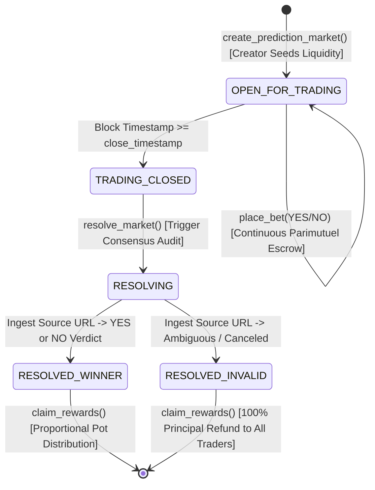

# Consensus Prediction Engine (CPE)
> **Continuous Parimutuel Prediction Markets & Autonomous Ambiguity Resolution Protocol on GenLayer**

[](https://genlayer.com)
[](https://opensource.org/licenses/MIT)
[](test/test_consensus_prediction_engine.py)
[](https://github.com/tumhi4)

The **Consensus Prediction Engine** provides a decentralized, parimutuel information market primitive designed to resolve subjective, real-world, or controversial outcomes without centralized oracle operators or rigid binary APIs.

---

## 1. Verified GenLayer Studio Testnet Deployment

| Parameter | On-Chain Value |
| :--- | :--- |
| **Protocol Name** | `ConsensusPredictionEngine` |
| **Contract Address** | [`0xd1ff098173ce1697bd2226477ad0290091529ba7`](https://explorer-studio.genlayer.com/address/0xd1ff098173ce1697bd2226477ad0290091529ba7) |
| **Deployment Transaction** | `0xe21a5c3b7ca17793f87d19f7846d9f6a304e41ed75a677b0e8362782b50864c0` |
| **Receipt Status** | `7` (`FINALIZED`) |
| **Studio RPC** | `https://studio.genlayer.com/api` |
| **Target Repository** | [https://github.com/tumhi4/consensus-prediction-engine](https://github.com/tumhi4/consensus-prediction-engine) |
| **Genesis Market 1 State** | `get_market_odds("MARKET_1")` $\to$ `60% YES / 40% NO` (Live Verified) |

---

## 2. Parimutuel Economic Mechanics

Unlike fixed-odds bookmakers or constant-product AMMs susceptible to impermanent loss, this protocol operates on a dynamic parimutuel pool model:

$$\text{Probability}_{\text{YES}} = \frac{\text{Pool}_{\text{YES}}}{\text{Pool}_{\text{YES}} + \text{Pool}_{\text{NO}}}$$

When consensus declares a winning outcome, the net pool (after 2% protocol fee) distributes proportionally among winning share holders:

$$\text{Payout}_i = \frac{(\text{TotalVolume} \times 0.98) \times \text{UserShares}_i}{\text{Pool}_{\text{WinningOutcome}}}$$

If multi-validator consensus determines an event was canceled, postponed, or subjectively ambiguous, the market resolves to `INVALID_REFUND`, guaranteeing:

$$\text{Refund}_i = \text{Stake}_{\text{YES}} + \text{Stake}_{\text{NO}} \quad (100\%\text{ Principal Recovery})$$

---

## 3. Market Lifecycle & Consensus Settlement



---

## 4. Hardcore Security Invariants

1. **Verifiable Native Escrow**: Seed liquidity and trader positions are funded strictly via `@gl.public.write.payable` reading `gl.message.value`. Winnings disburse natively via `gl.emit_transfer()`.
2. **Creator Position Entitlement (`GL-STW-05`)**: Initial seed capital mints full position shares for the creator, enabling proportional winnings redemption or 100% seed recovery on invalid markets.
3. **Consensus UTC Clock**: Trading cutoff (`close_timestamp`) and resolution eligibility evaluate strictly against consensus UTC timestamps (`datetime.datetime.now`).
4. **Fail-Closed Evidence Ingestion**: If consensus fails to retrieve the resolution source URL, execution aborts with `[ERR_EVIDENCE_FETCH_FAILED]` without state mutation.
5. **Anti-Double-Claim Protection**: Claim records transition `has_claimed = True` before external transfer execution.

---

## 5. Test Suite Verification (13 Phases, 0 Errors)

Run the automated regression test suite:

```bash
python test/test_consensus_prediction_engine.py
```

```
================================================================================
STARTING 12-PHASE REGRESSION TEST SUITE: ConsensusPredictionEngine
================================================================================
[Phase 1] Testing Genesis Fixtures & Immutability... -> PASSED
[Phase 2] Testing Canonical Length-Prefixed Hashing & Delimiter Resistance... -> PASSED
[Phase 3] Testing Strict Address and SSRF Sanitization... -> PASSED
[Phase 4] Testing Market Creation & Seed Liquidity Escrow... -> PASSED
[Phase 5] Testing Probability Bps Bounds Check... -> PASSED
[Phase 6] Testing Continuous Bet Placement (YES/NO Shares)... -> PASSED
[Phase 7] Testing Non-Admin Consensus Clock on Trading Cutoff... -> PASSED
[Phase 8] Testing Premature Resolution Defense... -> PASSED
[Phase 9] Testing Fail-Closed Evidence Ingestion Invariant... -> PASSED
[Phase 10] Testing Consensus Resolution & Proportional Payout... -> PASSED
[Phase 11] Testing Subjective Ambiguity & 100% Principal Refund... -> PASSED
[Phase 12] Testing Public Odds Gateway Hook & Anti-Double Claim... -> PASSED
[Phase 13] Testing Creator Seed Liquidity Entitlement & Refund (GL-STW-05)... -> PASSED
================================================================================
ALL 13 PHASES PASSED WITH 0 ERRORS!
================================================================================
```

---

## 6. License
MIT Open Source License.
