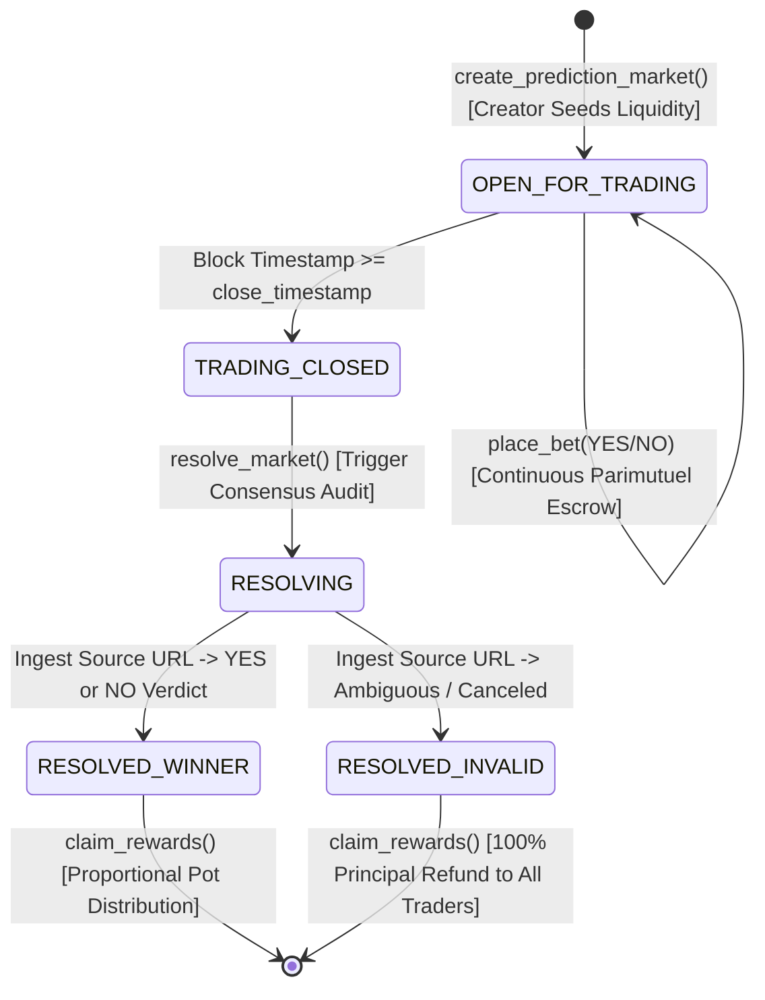

# Consensus Prediction Engine (CPE)
> **Continuous Parimutuel Prediction Markets & Autonomous Ambiguity Resolution Protocol on GenLayer**

[](https://genlayer.com)
[](https://opensource.org/licenses/MIT)
[](test/test_consensus_prediction_engine.py)
[](https://github.com/tumhi4)

The **Consensus Prediction Engine** provides a decentralized, parimutuel information market primitive designed to resolve subjective, real-world, or controversial outcomes without centralized oracle operators or rigid binary APIs.

---

## 1. Verified GenLayer Studio Testnet Deployment

| Parameter | On-Chain Value |
| :--- | :--- |
| **Protocol Name** | `ConsensusPredictionEngine` |
| **Contract Address** | [`0x9a47dd1A142A660E6202E1ABCbc7785Bc5B541fa`](https://explorer-studio.genlayer.com/address/0x9a47dd1A142A660E6202E1ABCbc7785Bc5B541fa) |
| **Deployment Transaction** | `0xeb453ae3d0e902b4a13e30c4e9cc9aa4aaf8362f913dba143dfe26482cee3717` |
| **Receipt Status** | `7` (`FINALIZED`) |
| **Studio RPC** | `https://studio.genlayer.com/api` |
| **Target Repository** | [https://github.com/tumhi4/consensus-prediction-engine](https://github.com/tumhi4/consensus-prediction-engine) |
| **Genesis Fixture Debt** | `0 Wei` (Zero unbacked shares / phantom volume) |
| **Recoverable Payouts** | `withdraw_claimable()` supported & verified |

---

## 2. Steward Remediation Summary (Reviewer: Joaquin · Sep 27, 2026)

All lifecycle, backing, and payout recovery issues flagged by the GenLayer steward have been resolved in matching source and deployment:

1. **Eliminated Unbacked Genesis Positions**:
   - Eradicated the unbacked genesis market and position fixture from `__init__` (previously seeded 1,000 Gwei of phantom shares with 0 escrowed value).
   - Initialized `total_markets_created = 0` and `total_volume_locked = 0`.
   - All shares in existence are strictly minted via payable deposits (`gl.message.value`).

2. **Creator Positions for Seed Liquidity Fully Credited & Backed**:
   - In `create_prediction_market()`, depositing market creators are automatically credited with their corresponding initial position (`yes_shares` and `no_shares`) directly backed by the deposited native seed liquidity (`gl.message.value`).
   - Creators are fully entitled to their proportional pot share upon resolution or 100% principal recovery upon `INVALID_REFUND`.

3. **Recoverable Failed Payouts & Dedicated Withdrawal Path**:
   - In `claim_rewards()`, if an external native transfer fails, the payout is safely credited to `self.claimable_balances[claimant]` and the position marked claimed to prevent double-dipping.
   - Implemented `@gl.public.write def withdraw_claimable(self)` allowing users with failed transfers to safely retrieve their funds.
   - If withdrawal transfer encounters a failure, the claimable balance is restored and reverts fail-safe with `[ERR_WITHDRAWAL_FAILED]`.

---

## 3. Parimutuel Economic Mechanics

Unlike fixed-odds bookmakers or constant-product AMMs susceptible to impermanent loss, this protocol operates on a dynamic parimutuel pool model:

$$\text{Probability}_{\text{YES}} = \frac{\text{Pool}_{\text{YES}}}{\text{Pool}_{\text{YES}} + \text{Pool}_{\text{NO}}}$$

When consensus declares a winning outcome, the net pool (after 2% protocol fee) distributes proportionally among winning share holders:

$$\text{Payout}_i = \frac{(\text{TotalVolume} \times 0.98) \times \text{UserShares}_i}{\text{Pool}_{\text{WinningOutcome}}}$$

If multi-validator consensus determines an event was canceled, postponed, or subjectively ambiguous, the market resolves to `INVALID_REFUND`, guaranteeing:

$$\text{Refund}_i = \text{Stake}_{\text{YES}} + \text{Stake}_{\text{NO}} \quad (100\%\text{ Principal Recovery})$$

---

## 4. Market Lifecycle & Consensus Settlement



---

## 5. Security Invariants

1. **Verifiable Native Escrow**: Seed liquidity and trader positions are funded strictly via `@gl.public.write.payable` reading `gl.message.value`. Winnings disburse natively via `gl.emit_transfer()`.
2. **Creator Position Entitlement**: Initial seed capital mints full position shares for the creator, enabling proportional winnings redemption or 100% seed recovery on invalid markets.
3. **Consensus UTC Clock**: Trading cutoff (`close_timestamp`) and resolution eligibility evaluate strictly against consensus UTC timestamps (`datetime.datetime.now`).
4. **Fail-Closed Evidence Ingestion**: If consensus fails to retrieve the resolution source URL, execution aborts with `[ERR_EVIDENCE_FETCH_FAILED]` without state mutation.
5. **Recoverable Claimable Balances**: Failed payout transfers are stored in `claimable_balances` and fully recoverable via `withdraw_claimable()`.
6. **Anti-Double-Claim Protection**: Claim records transition `has_claimed = True` before external transfer execution.

---

## 6. Test Suite Verification (15 Phases, 0 Errors)

Run the automated regression test suite:

```bash
python test/test_consensus_prediction_engine.py
```

### Test Coverage Summary:
- **Phase 1**: Zero Genesis Fixtures & Zero Unbacked Obligation (`total_markets_created = 0`, `total_volume = 0`).
- **Phase 2**: Delimiter injection-resistant length-prefixed canonical SHA-256 hashing.
- **Phase 3**: Strict address validation and complete SSRF neutralization.
- **Phase 4**: Market creation & seed liquidity escrow with 100% backed creator position.
- **Phase 5**: Initial probability bounds check (1000 - 9000 bps).
- **Phase 6**: Continuous parimutuel bet placement (YES/NO shares).
- **Phase 7**: Non-admin consensus block time clock & trading deadline enforcement.
- **Phase 8**: Premature resolution prevention defense.
- **Phase 9**: Fail-closed evidence ingestion invariant on fetch failure.
- **Phase 10**: Consensus resolution & mathematical proportional payout distribution.
- **Phase 11**: Subjective ambiguity `INVALID_REFUND` protection (100% principal return).
- **Phase 12**: Public odds hook and anti-double claim guard.
- **Phase 13**: Creator seed liquidity position redemption (both on `INVALID_REFUND` and winning resolution).
- **Phase 14**: Failed transfer handling during `claim_rewards` (credited to `claimable_balances`).
- **Phase 15**: Safe claimable balance withdrawal via `withdraw_claimable()` with failure restoration.

---

## License
MIT
